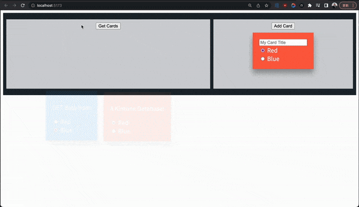
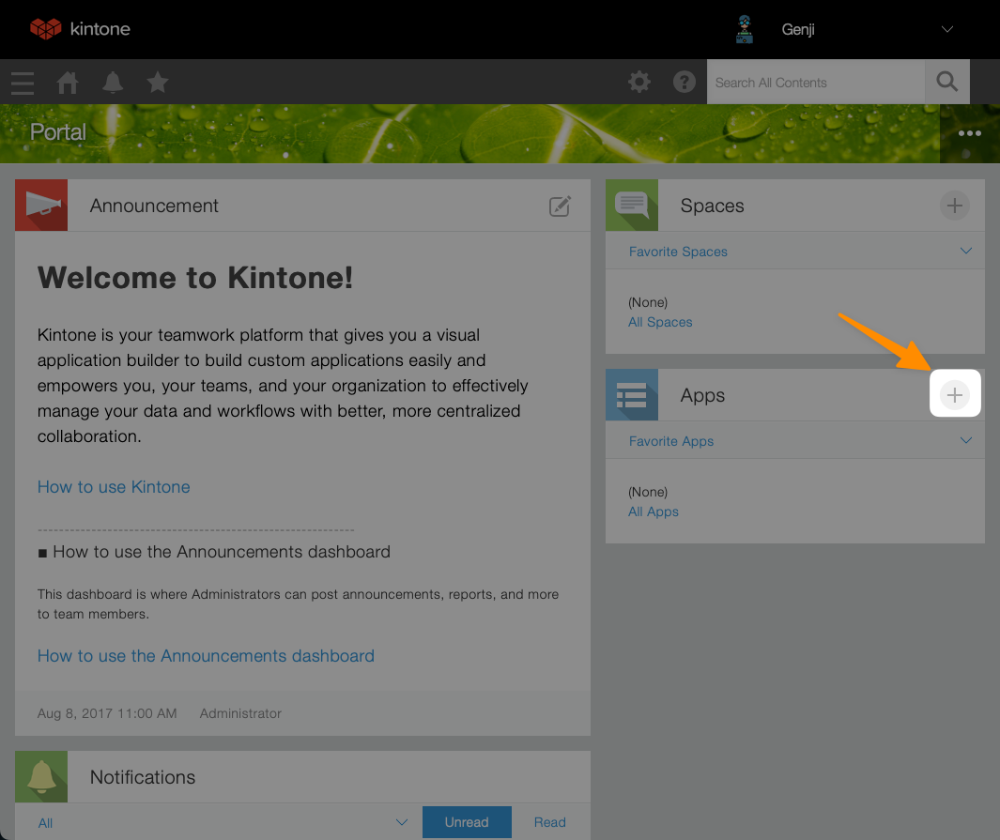
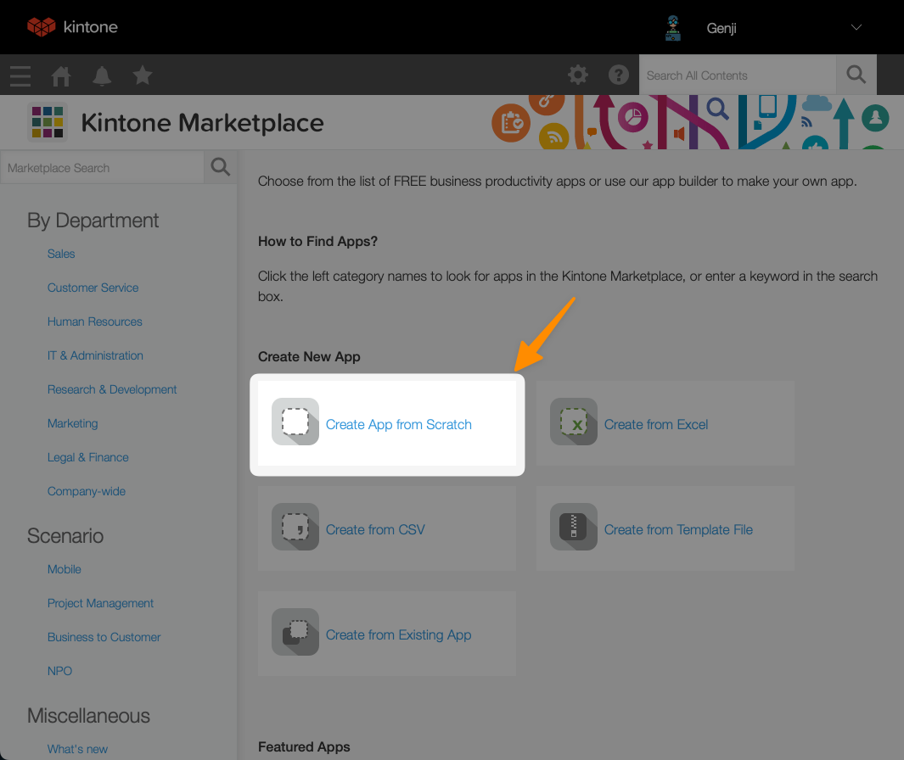
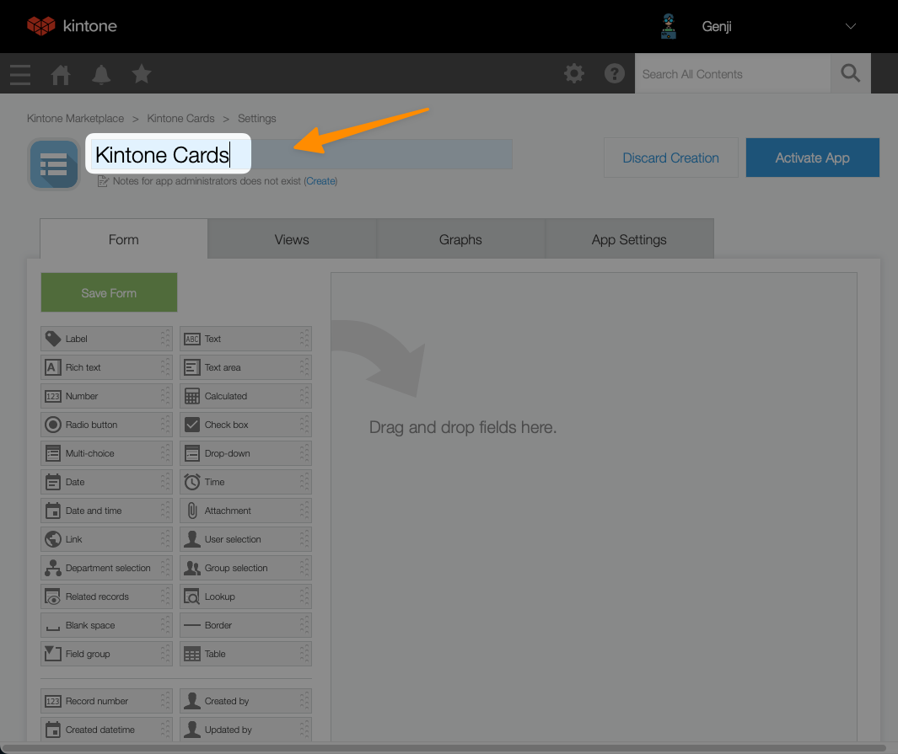
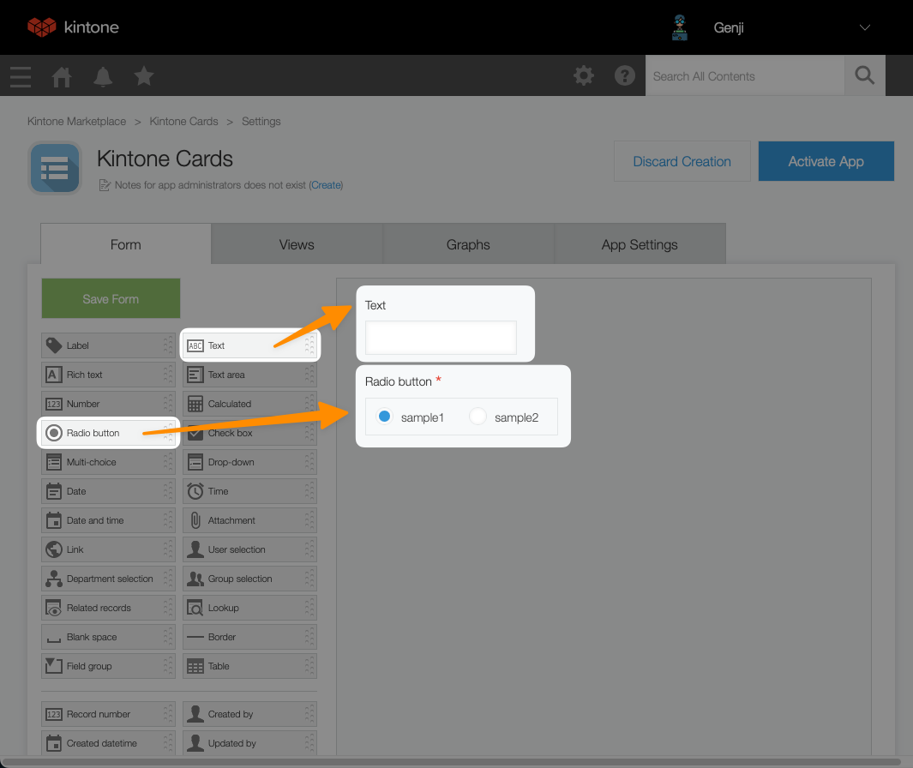
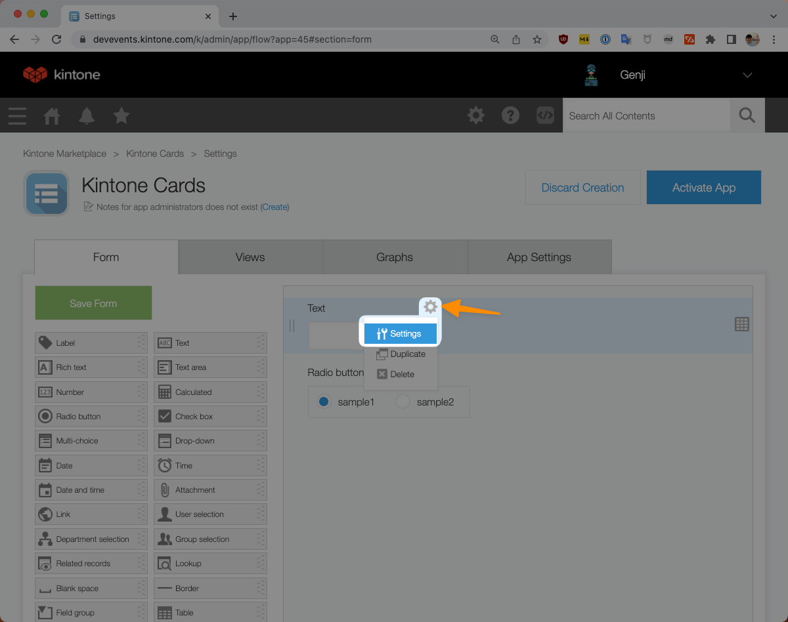
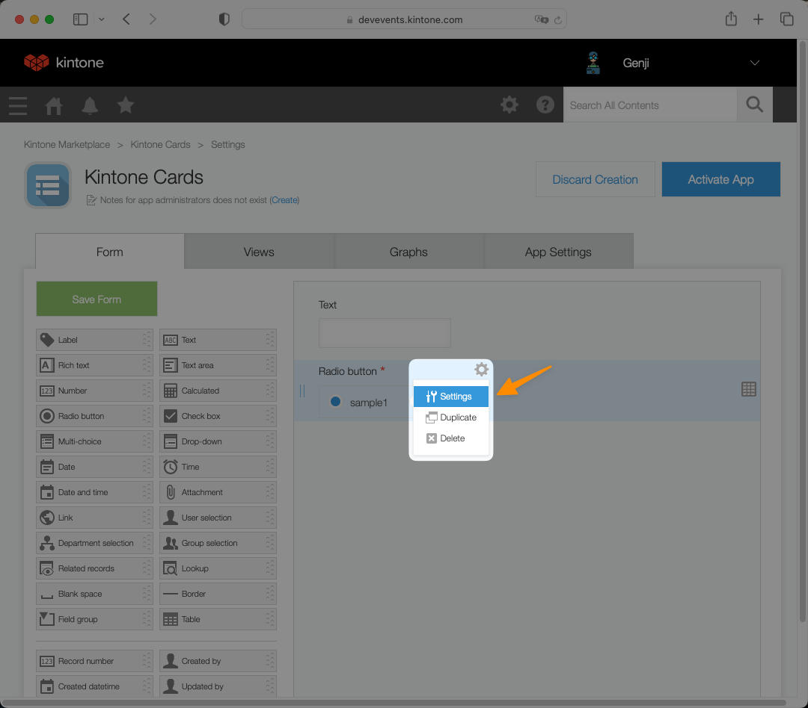
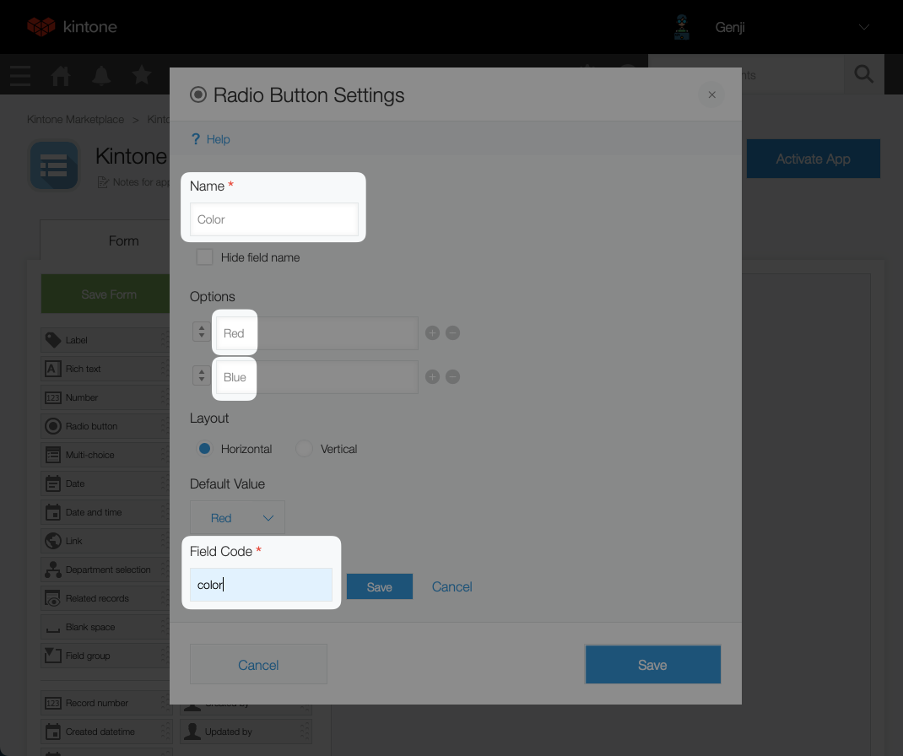
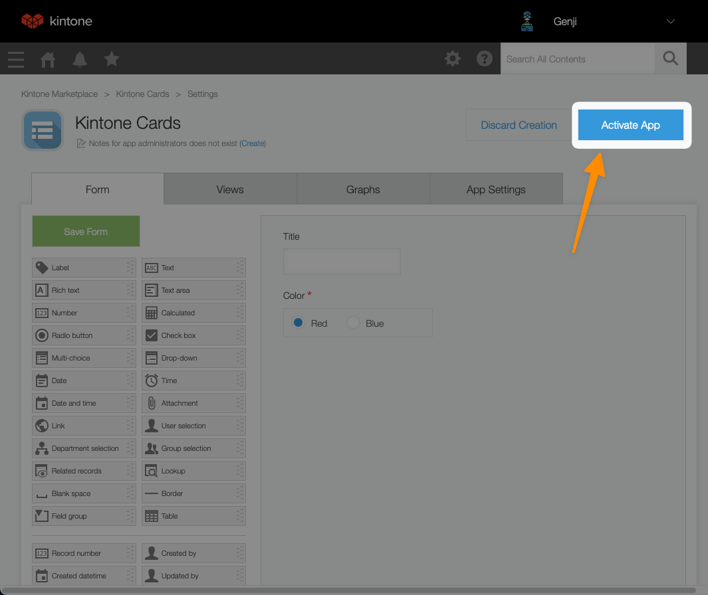

# Getting Started With Svelte (Stop Using React!)


Learn why **Svelte is the most loved web framework** & let's **build your first Svelte App** with a Kintone Database!

Our free, live workshop will walk you through creating a Web Database App, setting up a Svelte project, and using GET and POST requests to save to a Kintone web database.

## Outline <!-- omit in toc -->
* [Completed Project](#completed-project)
* [Get Started](#get-started)
* [Get Your Free Kintone Database](#get-your-free-kintone-database)
* [Create a Kintone Web Database App](#create-a-kintone-web-database-app)
* [Kintone API Token](#kintone-api-token)
* [Create a `.env` File](#create-a-env-file)
* [Workshop Steps](#workshop-steps)
  * [Files to Edit](#files-to-edit)
  * [`+page.svelte` File](#pagesvelte-file)
  * [`+server.js` File](#serverjs-file)
  * [Solutions to the Tasks](#solutions-to-the-tasks)
* [Appendix](#appendix)
  * [What is Svelte?](#what-is-svelte)
  * [What is Kintone?](#what-is-kintone)
* [Debugging - Let's Fix Those Problems 💪](#debugging---lets-fix-those-problems-)
  * [`npm install` command is not working](#npm-install-command-is-not-working)
  * [Unable to Add Card?](#unable-to-add-card)
  * [Unable to Add a Card?](#unable-to-add-a-card)
  * [Unexpected end of JSON input Error?](#unexpected-end-of-json-input-error)

---

## Completed Project


## Get Started

First, clone the [kintone-workshops/intro-to-svelte](https://github.com/kintone-workshops/intro-to-svelte) repo!  🚀  
Then go inside the folder.

```shell
cd Downloads

git clone https://github.com/kintone-workshops/intro-to-svelte

cd intro-to-svelte
```

Open the `intro-to-svelte` folder in [VS Code](https://code.visualstudio.com/docs/getstarted/tips-and-tricks#_command-line) as well:

```shell
code .
```

Once you are inside the folder, let's install the dependencies and open our project:

```shell
npm install

npm run dev
```

## Get Your Free Kintone Database

[bit.ly/KDP_NEW](http://bit.ly/KDP_NEW)
* ⚡ Only use lowercase, numbers, & hyphens in your subdomain
* ⚠ Do not use uppercase or special characters

|                                                                                            |                                                                                                                      |
| ------------------------------------------------------------------------------------------ | -------------------------------------------------------------------------------------------------------------------- |
|  |  |

---

## Create a Kintone Web Database App

| Steps                                                                                  | Screenshot                                                                                                                            |
| -------------------------------------------------------------------------------------- | ------------------------------------------------------------------------------------------------------------------------------------- |
| From the Kintone portal, click the [+] button to create an App                         |                 |
| Select **Create App from Scratch** option                                              |  |
| Name the App (Ex: _Kintone Cards_)                                                     |                                                            |
| Add **Text** and **Radio Button** fields                                               |                                            |
| Open the **Text** field settings                                                       |                                    |
| Set the **Name** (`Title`) and **Field Code** (`title`)                                |                                                  |
| Open the **Radio Button** field settings                                               |                            |
| Set the **Name** (`Color`), **Options** (`Red` & `Blue`), and **Field Code** (`color`) |                        |
| Last, remember to save your changes!                                                   |                                                          |

⚠️ Warning ⚠️
* Field Code is case sensitive
* Field Code and options must be as specified in the steps, or the code will not work

---

## Kintone API Token

To generate an API Token for a Kintone App:

1. Go to the Kintone App
1. Go to the Gear icon ⚙️ (top right corner) > Open the App Settings page
1. Click on the **App Settings** Tab > Click on **API Token** settings
1. Click the `Generate` button to generate a token
1. Enable the `View records`, `Add records` and `Edit records` checkboxes
1. Click the `Save` button (top left corner) to save the token setting
1. Finally, click the `Update App` button (top right corner) to implement the token setting change.

Confused? 🤔 → Check out the gif below:

<details>
  <summary>Generate a Kintone API Token Gif 📺</summary>

  

</details>

---

## Create a `.env` File

1. Using the [.env.example](.env.example) file as a template, create a `.env` file.
1. Then input your Kintone credentials like the following:

```txt
VITE_SUBDOMAIN = "example"
VITE_APPID = "1"
VITE_APITOKEN = "abcdefghijklmnopqrstuvwxyz"
```

### ⚠️ DO NOT DELETE THE [.env.example](.env.example) FILE!  <!-- omit in toc -->
[.env.example](.env.example) is used by env-cmd to verify that `.env` file is correctly configured.

---

## Workshop Steps

### Files to Edit
1. Credentials - Create `.env` file by duplicating the [.env.example](.env.example) file
1. Frontend that builds the cards - [src/routes/+page.svelte](src/routes/+page.svelte)
1. Backend that connects with Kintone - [src/routes/kintone/+server.js](src/routes/kintone/+server.js)

### `+page.svelte` File
Two tasks in `+page.svelte` file:
* [ ] Task 1 - Add the cards from Kintone to the `cardInfo` array
* [ ] Task 2 - Add a loop to go through the `cardInfo` array and display the cards

### `+server.js` File
Two tasks in `+server.js` file:
* [ ] Task 3 - Get our title and color of the card to POST to Kintone
* [ ] Task 4 - Try filling out this POST fetch to Kintone

### Solutions to the Tasks

<details>
  <summary>Task 1 - Add the cards from Kintone to the cardInfo array</summary>

  File: [src/routes/+page.svelte](src/routes/+page.svelte)

  ```javascript
  cardsInfo.forEach((card) => {
   cards.push({
    title: card.title.value,
    color: card.color.value,
    id: card.Record_number.value
   });
  });
  console.log(cards);
  if (cards.length >= 1) {
   visible = true;
  }
 };
  ```

</details>

<details>
  <summary>Task 2 - Add a loop to go through the cardInfo array and display the cards</summary>

  File: [src/routes/+page.svelte](src/routes/+page.svelte)

  ```javascript
    {#each cards as card, i}
     <div
      class:blue-card={card.color === 'Blue'}
      class:red-card={card.color === 'Red'}
      in:fly|local={{ y: 200, duration: 2000 + i * 10000 }}
     >
      <p>{card.title}</p>
      <label>
       <input type="radio" bind:group={card.color} value="Red" name={i} />
       Red
      </label>
      <label>
       <input type="radio" bind:group={card.color} value="Blue" name={i} />
       Blue
      </label>
     </div>
    {/each}
  ```

</details>

<details>
  <summary>Task 3 - Get our title and color of the card to POST to Kintone</summary>

  File: [src/routes/kintone/+server.js](src/routes/kintone/+server.js)

  ```javascript
  const body = await request.json();
  let title = await body.title;
  let color = await body.color
  const requestBody = {
    'app': appid,
    'record': {
    'title': {
      'value': title
    },
    'color': {
      'value': color
    }
    }
  }
  ```

</details>

<details>
  <summary>Task 4 - Try filling out this POST fetch to Kintone</summary>

  File: [src/routes/kintone/+server.js](src/routes/kintone/+server.js)

  ```javascript
  try {
    let response = await fetch(postRecordsURL, fetchOptions);
    const responseData = await response.json();
    return new json(responseData);
  } catch (error) {
    console.log(error)
  }
  ```

</details>

---

## Appendix

### What is Svelte?

Svelte is a free, open-source frontend JavaScript framework for making interactive web apps.

* Unlike React, Svelte compiles code to small, framework-less vanilla JS to optimize for speed
* Unlike React, Svelte surgically updates the DOM, so you don't have to worry about a virtual DOM diffing.

### What is Kintone?

Kintone is a no-code/low-code cloud platform for teams to quickly & easily share and collaborate on their data.

You can add JavaScript, CSS, &/or HTML to enhance the frontend UI/UX of a Kintone App. This can include features such as maps, buttons, and color-coding.

Read up on how to customize and develop on the Kintone platform at [kintone.dev](https://kintone.dev/)

---

## Debugging - Let's Fix Those Problems 💪

Here is a rundown of common problems that may occur & their solutions!

### `npm install` command is not working

1. Verify the Node.js & npm versions **inside** the `intro-to-svelte` folder
2. Just installed Node.js? Verify you configured Node.js versions **inside** the `intro-to-svelte` folder

* Mac: `nodenv local 14.5.0`
* Windows: `nvm use 14.5.0`

### Unable to Add Card?

Did you get a `Invalid response from route /kintone: handler should return a Response object`?

Error Message:

```txt
POSTING TO: https://undefined.kintone.com/k/v1/record.json?app=undefined title: null, color: null
Invalid response from route /kintone: handler should return a Response object
Error: Invalid response from route /kintone: handler should return a Response object
    at render_endpoint (file:///Users/.../Downloads/intro-to-svelte/node_modules/@sveltejs/kit/src/runtime/server/endpoint.js:44:10)
    ...
```

Looks like you forgot the `.env` file! 🤦  
Make sure included your Kintone Subdomain in the `.env` file!

### Unable to Add a Card?
Are you getting no error message from the terminal nor the browser console but still unable to add a new card to the board (or Kintone)?

Verify that
* the Kintone App's API Token has permissions for `Add records` and `Edit records`
* the Kintone App's settings has been saved and you clicked on the blue `Update App` button

### Unexpected end of JSON input Error?

Solution: Verify that you have `Saved` and `Updated` the Kintone App after generating the API Token.

Error Message:

```shell
Uncaught (in promise) SyntaxError: Unexpected end of JSON input at HTMLButtonElement.getCards (+page.svelte? [sm]:17:40)”
```
