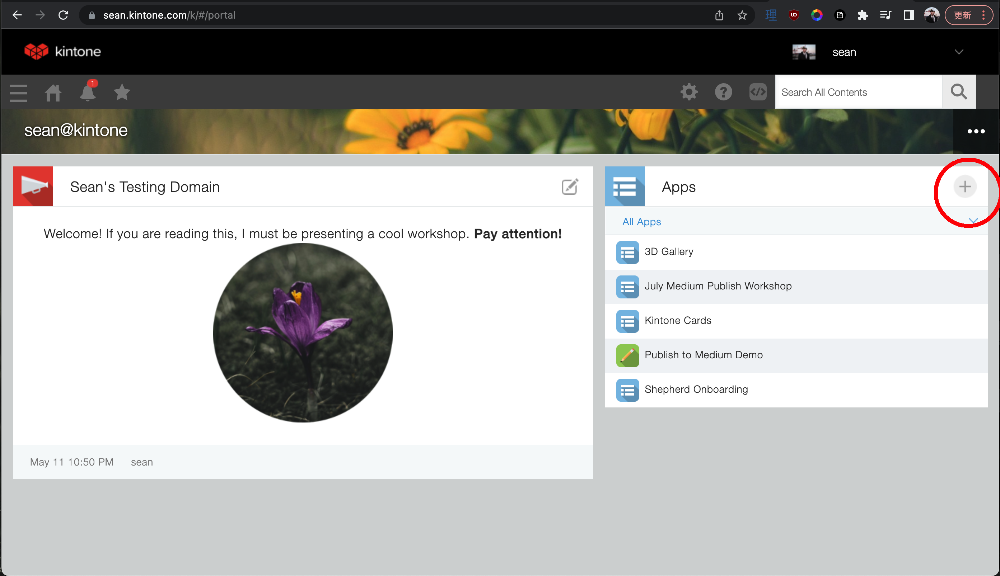
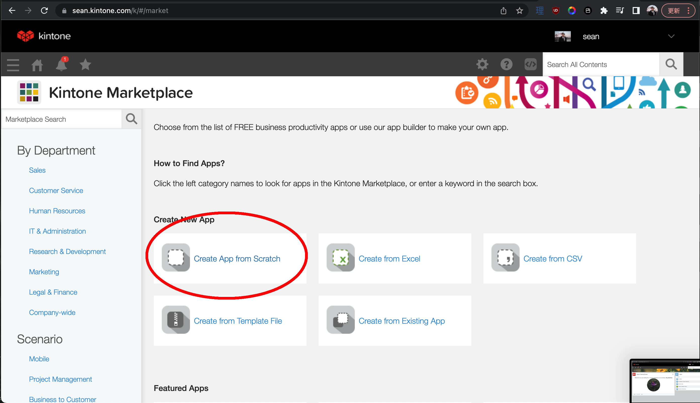
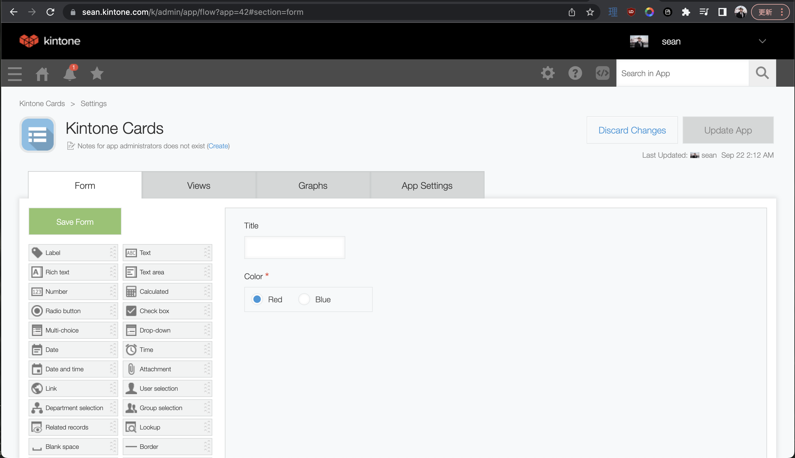
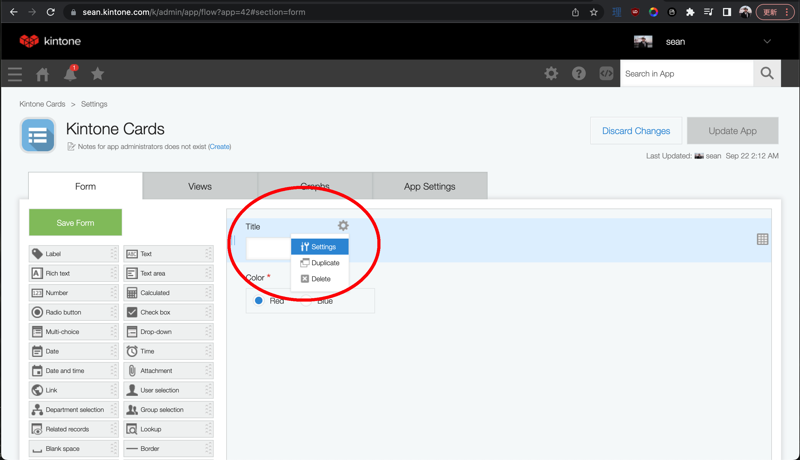
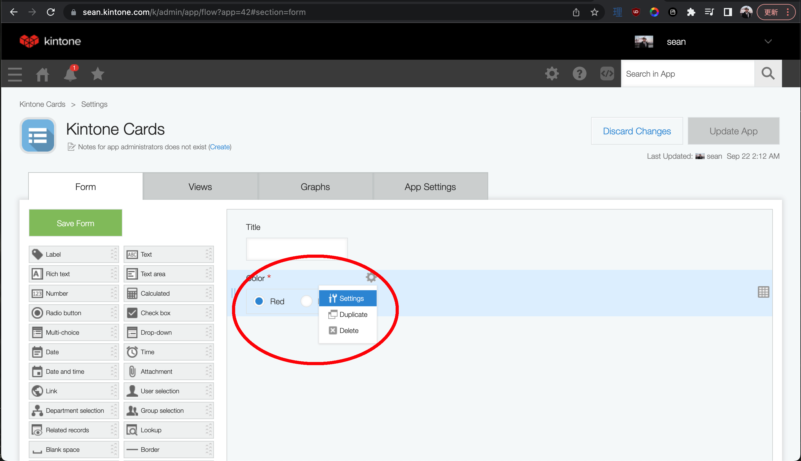
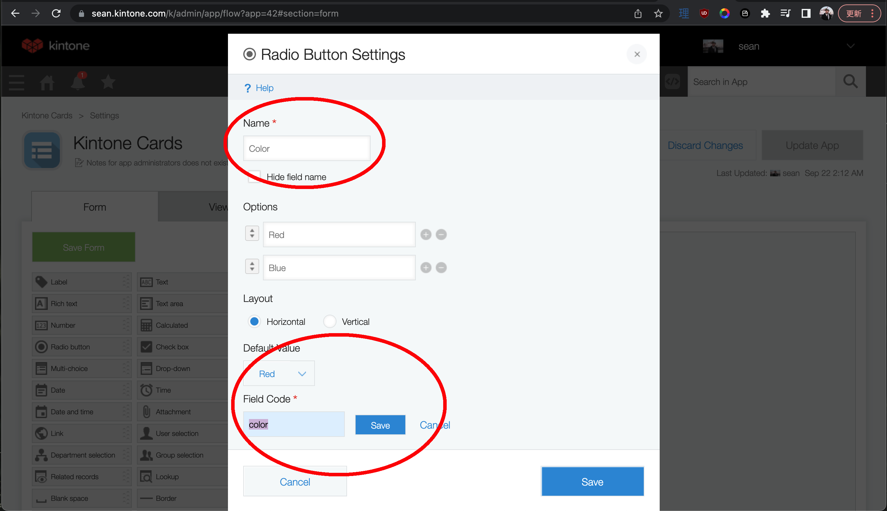
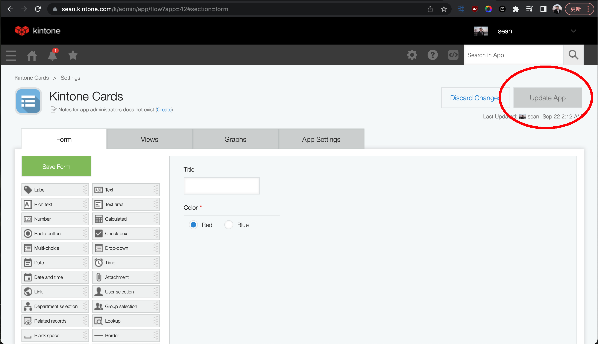

# Getting Started With Svelte (Stop Using React!)


**Learn why Svelte has recently been voted the most loved web framework & let's build your first Svelte App with a Kintone Database**  

Our free, live workshop will walk you through creating a Web Database App, setting up a Svelte project, and using GET and POST requests to save to a Kintone web database.

## Outline <!-- omit in toc -->
- [Getting Started With Svelte (Stop Using React!)](#getting-started-with-svelte-stop-using-react)
  - [Finished Project](#finished-project)
  - [Get Started](#get-started)
  - [Get Your Free Kintone Database](#get-your-free-kintone-database)
  - [Create a Kintone Web Database App](#create-a-kintone-web-database-app)
      - [From your portal, click the add app button](#from-your-portal-click-the-add-app-button)
      - [And create an app from scratch](#and-create-an-app-from-scratch)
      - [Add a Text box, and a Radio Button](#add-a-text-box-and-a-radio-button)
      - [Edit the settings of the text box](#edit-the-settings-of-the-text-box)
      - [Change the label, and field code (case sensitive!)](#change-the-label-and-field-code-case-sensitive)
      - [Once more for the Radio Button](#once-more-for-the-radio-button)
      - [Change the label, and field code (case sensitive!)](#change-the-label-and-field-code-case-sensitive-1)
      - [Last, don't forget to save your changes!](#last-dont-forget-to-save-your-changes)
  - [Kintone API Token](#kintone-api-token)
  - [Create a `.env` File](#create-a-env-file)
  - [Appendix](#appendix)
    - [What is Svelte?](#what-is-svelte)
    - [What is Kintone?](#what-is-kintone)
  - [Debugging - Let's Fix Those Problems 💪](#debugging---lets-fix-those-problems-)
    - [`npm install` command is not working](#npm-install-command-is-not-working)

---

## Finished Project


## Get Started

First, clone the [kintone-workshops/intro-to-svelte](https://github.com/kintone-workshops/intro-to-svelte) repo!  🚀  
Then go inside the folder.

```shell
cd Downloads

git clone https://github.com/kintone-workshops/intro-to-svelte

cd intro-to-svelte
```

Open the `intro-to-svelte` folder in [VS Code](https://code.visualstudio.com/docs/getstarted/tips-and-tricks#_command-line) as well:

```shell
code .
```

Once you are inside the folder, let's install the dependencies and open our project:

```shell
npm install

npm run dev
```

## Get Your Free Kintone Database

[bit.ly/KDP_NEW](http://bit.ly/KDP_NEW)
* ⚡ Only use lowercase, numbers, & hyphens in your subdomain
* ⚠ Do not use uppercase or special characters

|                                                                                            |                                                                                                                      |
| ------------------------------------------------------------------------------------------ | -------------------------------------------------------------------------------------------------------------------- |
|  |  |

---

## Create a Kintone Web Database App

#### From your portal, click the add app button

#### And create an app from scratch

#### Add a Text box, and a Radio Button

#### Edit the settings of the text box

#### Change the label, and field code (case sensitive!)

#### Once more for the Radio Button

#### Change the label, and field code (case sensitive!)

#### Last, don't forget to save your changes!


---

## Kintone API Token

To generate an API Token for a Kintone App:

1. Go to the Kintone App
1. Go to the Gear icon ⚙️ (top right corner) > Open the App Settings page
1. Click on the **App Settings** Tab > Click on **API Token** settings
1. Click the `Generate` button to generate a token
1. Enable the `Add records` and `Edit records` checkboxes
1. Click the `Save` button (top left corner) to save the token setting
1. Finally, click the `Update App` button (top right corner) to implement the token setting change.

Confused? 🤔 → Check out the gif below:

<details>
  <summary>Generate a Kintone API Token Gif 📺</summary>

  

</details>

---

## Create a `.env` File

1. Using the [.env.example](.env.example) file as a template, create a `.env` file.
1. Then input your Kintone credentials like the following:

```txt
SUBDOMAIN = "example"
APPID = "1"
APITOKEN = "abcdefghijklmnopqrstuvwxyz"
```

### ⚠️ DO NOT DELETE THE [.env.example](.env.example) FILE!  <!-- omit in toc -->
[.env.example](.env.example) is used by env-cmd to verify that `.env` file is correctly configured.

---

## Appendix

### What is Svelte?

Svelte is a free, open-source frontend JavaScript framework for making interactive web apps.

* Unlike React, Svelte compiles code to small, framework-less vanilla JS to optimize for speed
* Unlike React, Svelte surgically updates the DOM, so you don't have to worry about a virtual DOM diffing.

### What is Kintone?

Kintone is a no-code/low-code cloud platform for teams to quickly & easily share and collaborate on their data.

You can add JavaScript, CSS, &/or HTML to enhance the frontend UI/UX of a Kintone App. This can include features such as maps, buttons, and color-coding.

Read up on how to customize and develop on the Kintone platform at [kintone.dev](https://kintone.dev/)

---

## Debugging - Let's Fix Those Problems 💪

Here is a rundown of common problems that may occur & their solutions!

### `npm install` command is not working

1. Verify the Node.js & npm versions **inside** the `intro-to-svelte` folder
2. Just installed Node.js? Verify you configured Node.js versions **inside** the `intro-to-svelte` folder

* Mac: `nodenv local 14.5.0`
* Windows: `nvm use 14.5.0`
